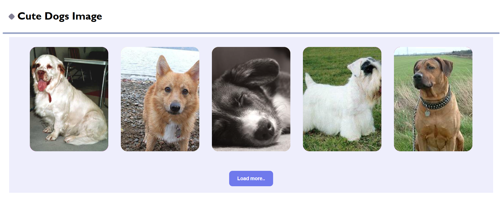

# 🐾 Random Dog Gallery

**Random Dog Gallery** is a simple and fun web project that fetches and displays random dog images using the free [Dog CEO API](https://dog.ceo/dog-api/).  
With a clean UI and a **Load More** feature, users can keep browsing an endless gallery of cute dogs 🐕.

---

## 🚀 Features
- Fetches random dog images from a public API.
- Displays **5 images at a time** in a responsive gallery.
- "Load More" button loads **only new images** (previous ones are not reloaded).
- Colorful random background for each image container.
- Built with pure **HTML, CSS, and Vanilla JavaScript**.

---

## 📸 Demo Preview


---

## 📂 Project Structure
- ├── index.html # Main HTML page
- ├── style.css # Styling for layout and design
- ├── dogApp.js # JavaScript logic (API fetch + Load More feature)
- └── README.md # Project documentation

  
---

## ⚙️ How It Works
1. On page load, the app fetches **5 random dog images**.
2. Each image is displayed inside a colorful card (`.img-cont`).
3. When the **Load More** button is clicked, 5 new images are added without reloading old ones.

---

## ▶️ Getting Started
1. Clone the repo:
   ```bash
   git clone https://github.com/SaketTiwari2008/Random-Dog-Gallery.git
2. Open the folder and run the project:

3. Double-click index.html

   Or open with Live Server (VS Code extension).

4. Enjoy endless cute dog photos! 🐶❤️

---

## 📡 API Used

[Dog CEO's API](https://dog.ceo/dog-api/)

---

## ✨ Future Improvements

- Add breed filter option.

- Implement infinite scroll instead of button click.

- Allow users to favorite and save images.
